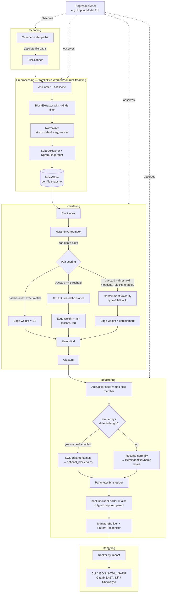
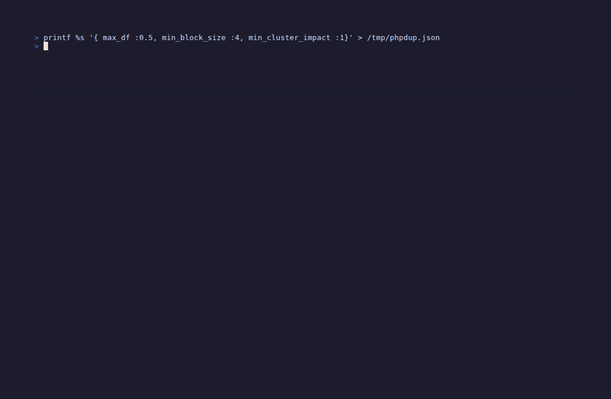
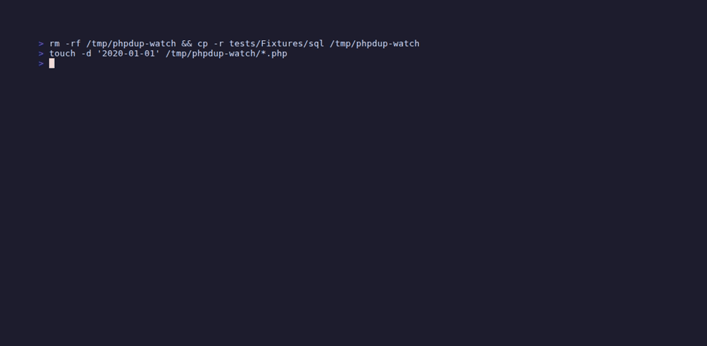
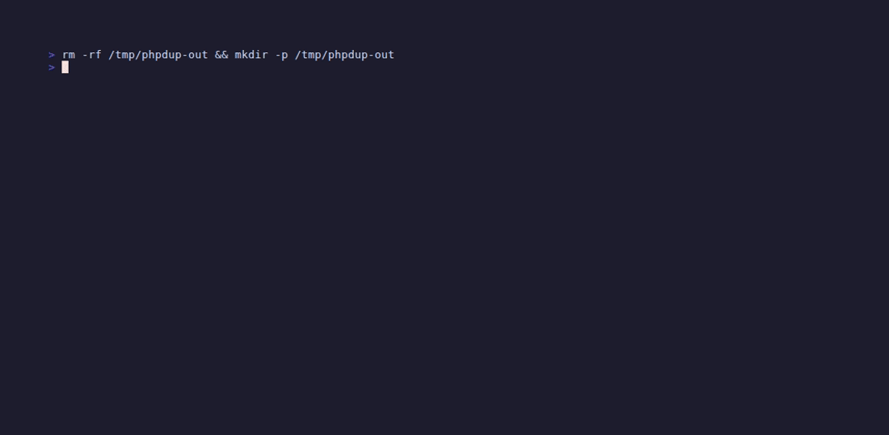
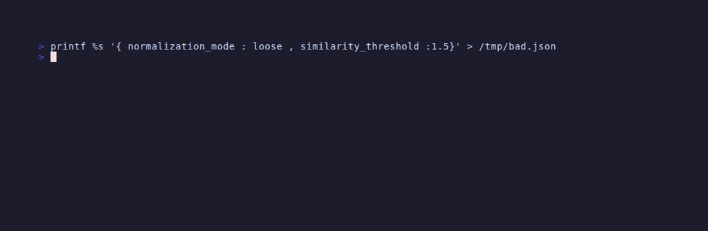

# phpdup — AST-based PHP duplicate-logic detector

> A semantic clone detector and refactoring assistant for PHP codebases.
> Behaves more like an "extract function" advisor than a copy/paste finder.

[](https://github.com/detain/php-dup-finder/actions/workflows/ci.yml)
[](https://app.codecov.io/gh/detain/php-dup-finder)
[](https://www.php.net)
[](LICENSE)

`phpdup` parses every file in a PHP codebase into an Abstract Syntax
Tree, normalizes those ASTs into a canonical form, and finds clusters
of **parameterizable duplication** — places where the *shape* of the
code repeats and only literals, identifiers, method names, table
names, or *whole optional segments of code* vary.

For each cluster it doesn't just point at the duplicates, it tells you
**what the abstraction would look like** — its parameter list, types,
and a suggested function name — ready to drop into a refactor.


A run on `tests/Fixtures` returns its top 2 clusters by impact. Each
cluster's "Suggested abstraction" box is the function signature
phpdup is recommending you extract; the "Holes" table lists every
parameter with its inferred type and the values observed across cluster
members. Compare with classic copy/paste detectors that only highlight
the duplication; phpdup tells you the threshold and the role string
*are the parameters of the abstraction* with their inferred types and
observed values, ready to apply.

---

## Table of contents

- [Features](#features)
- [Installation](#installation)
- [Quick start](#quick-start)
- [How it works](#how-it-works)
  - [Pipeline](#pipeline)
  - [Normalization modes](#normalization-modes)
  - [Clustering](#clustering)
  - [Anti-unification](#anti-unification)
  - [Pattern recognition](#pattern-recognition)
  - [Ranking](#ranking)
  - [Parallelism](#parallelism)
  - [Incremental indexing](#incremental-indexing)
  - [Lazy AST loading](#lazy-ast-loading)
- [Type-3 / optional-segment detection](#type-3--optional-segment-detection)
- [TUI mode](#tui-mode)
- [Watch mode](#watch-mode)
- [Output formats](#output-formats)
- [Configuration](#configuration)
- [CLI reference](#cli-reference)
- [Programmatic use](#programmatic-use)
- [Examples](#examples)
- [Static analysis & config validation](#static-analysis--config-validation)
- [Benchmarks](#benchmarks)
- [Architecture](#architecture)
- [Testing](#testing)
- [Performance](#performance)
- [FAQ](#faq)
- [Contributing](#contributing)
- [License](#license)

---

## Features

- **Semantic, not textual.** Compares AST structure, not source text — so
  whitespace, comments, and identifier renames don't fool it.
- **Three clone types.** Type-1 (exact), type-2 (renamed variables /
  literals), and **type-3** (statements present in some members but
  absent from others — see
  [Type-3 / optional-segment detection](#type-3--optional-segment-detection)).
- **Parameter discovery.** For every cluster, identifies the literals,
  identifiers, method names, class names, *and entire optional code
  segments* that vary, and proposes them as parameters of a suggested
  abstraction with inferred types and named placeholders.
- **Three normalization modes.** From `strict` (variable rename
  tolerant only) to `aggressive` (also collapses literal values, method
  names, property names, and class names) — pick the precision/recall
  trade-off you want.
- **Three-phase clustering.**
  - **Hash buckets** for exact canonical matches — O(N).
  - **N-gram inverted index + Jaccard + APTED tree-edit-distance** for
    near-duplicates — never quadratic in practice.
  - **Containment fallback** for type-3 clones whose Jaccard would fail
    because one block is a near-subset of another.
- **Anti-unification with statement-array LCS.** For every cluster
  phpdup computes the most-specific generalization of its members,
  using LCS over per-statement structural hashes when stmt arrays
  differ in length. Disagreements become typed parameter holes;
  per-statement gaps become defaulted boolean parameters.
- **Pattern recognition.** Tags clusters that match well-known refactor
  archetypes:
  - `sql-builder`        — string concat feeding `query`/`prepare`/`exec`/`fetch`
  - `crud-handler`       — names contain `create`/`read`/`update`/`delete` or `select`/`insert`/`fetch`/`find`
  - `validation-chain`   — short-circuit `if`-then-throw/return chains
  - `strategy`           — single hole on a method/function name
  - `config-driven`      — only literal holes
  - `state-machine`      — `switch`/`match` block
  - `optional-segments`  — at least one optional_block hole (type-3)
- **Impact-ranked output.** Clusters sorted by how many lines disappear
  if the abstraction is applied, with a separate confidence score that
  flags risky refactors (subtree-level holes, cross-namespace spans).
- **Seven output formats.**
  - SugarCraft-styled colorized **CLI** (with a `--plain` switch).
  - Structured **JSON** (machine-readable, full cluster + hole metadata
    including `present_in_members[]` for type-3 holes).
  - Interactive **HTML** site (sortable/filterable index, mini-map of
    cluster impact, copy-signature buttons, syntax-highlighted code,
    optional-segment rows tinted amber).
  - **SARIF 2.1.0** (GitHub Code Scanning / GitLab Code Quality, with
    grouping fingerprints + `optionalSegmentCount`).
  - **GitLab SAST v15.x** (MR security widget, severity-bucketed by
    impact).
  - **Unified diffs** per cluster + cumulative `--patch` file.
  - **Checkstyle XML** (Jenkins/Sonar/Bitbucket consumers).
- **Optional SugarCraft TUI** (`--tui`). Four-pane FlexBox dashboard
  driven by the cooperative pipeline — counts, sparkline, OSC 9;4
  taskbar progress all build up live frame-by-frame as work
  progresses. Six themes, full keyboard, ←/→ to cycle clusters in
  detail view.
- **Watch mode** (`--watch`). Re-runs analysis on file changes via a
  poll-based `React\EventLoop` timer; `Ctrl+C` exits cleanly. Combines
  with `--tui` for a live dashboard that resets and rebuilds on every
  change.
- **Block-kind filter** (`--kinds=method,closure`). Drops non-matching
  block kinds at extraction time so clustering only sees what you
  asked for.
- **Schema-validated config.** `phpdup.json` is checked against
  [`docs/config-schema.json`](docs/config-schema.json) at load time;
  `--validate-config` exits with the field path on the first violation
  before any analysis runs.
- **Shell completion** for bash, fish, and zsh via
  `phpdup completion <shell>`. Output is the standard Symfony Console
  completion script with commented-out installation instructions
  prepended, so you can paste-and-follow inline.
- **Composable pipeline** with cooperative iteration. Five stages
  (`Scanning`, `Preprocessing`, `Clustering`, `Refactoring`,
  `Reporting`) all implement a tiny `StageInterface` and share a
  `PipelineState`; cooperative stages additionally yield
  mid-execution so the TUI can repaint while parallel work is in
  flight. A `ProgressListener` interface lets observers (the TUI,
  watchers) hook in without touching stages.
- **Streaming worker pool.** `WorkerPool::runStreaming()` returns a
  `\Generator` that yields each child-process result as soon as it
  arrives — multiplexing children's per-process socketpairs via
  `stream_select` — so `PreprocessStage` can drive the dashboard live
  instead of blocking on the slowest worker. The classic
  collect-and-return `run()` is now a thin synchronous drain over the
  same code path.
- **Parallelized preprocessing and pair scoring.** `pcntl_fork`
  worker pool batches files for parse + extract + normalize +
  fingerprint, and candidate pairs for Jaccard + tree-edit-distance
  scoring. Auto CPU detection, serial fallback when pcntl is
  unavailable.
- **APTED-style tree edit distance.** Zhang-Shasha forest-distance DP
  with heavy-path child ordering and bounded early termination —
  correct on all tree shapes.
- **Incremental indexing.** Per-file block snapshots keyed by content
  hash + parser version + config key. Editing one file leaves the
  other 999 snapshots intact.
- **Lazy AST loading.** Original ASTs are dropped after fingerprinting
  and reloaded on demand only for blocks that end up in clusters. RSS
  scales sub-linearly with corpus size.
- **AST cache.** SHA-1 keyed disk cache (versioned to the parser
  release) so warm-cache runs skip parsing entirely.
- **Memory ceiling.** `--max-memory=MB` warns and suggests
  `--exact-only` if peak RSS exceeds the threshold mid-pipeline.
- **`--stage` halt point.** `--stage=clustering` runs the pipeline only
  up to (and including) clustering and stops — useful for debugging
  incremental cache hits or profiling individual stages.
- **Production-ready PHP.** Strict types throughout, PSR-4 autoloaded,
  PHPStan level 6 clean, Psalm baseline-tracked, **165+** PHPUnit
  tests, requires PHP 8.1+.

---

## Installation

### Via Composer

```bash
composer require --dev detain/php-dup-finder
vendor/bin/phpdup analyze src
```

The package isn't on Packagist yet — declare the GitHub repo manually:

```json
{
    "require-dev": {
        "detain/php-dup-finder": "dev-master"
    },
    "repositories": [
        { "type": "vcs", "url": "https://github.com/detain/php-dup-finder" }
    ],
    "minimum-stability": "dev",
    "prefer-stable": true
}
```

### From source

```bash
git clone https://github.com/detain/php-dup-finder.git
cd php-dup-finder
composer install
bin/phpdup analyze /path/to/your/code
```

Requirements:

- PHP 8.1 or newer
- ext-hash (for `xxh128`)
- ext-pcntl + ext-posix (optional — without them phpdup runs serially
  with no other change)
- Composer

---

## Quick start

Scan a directory and print the top duplicates (auto-parallelized):

```bash
bin/phpdup analyze src
```

Multiple directories with both reports:

```bash
bin/phpdup analyze src lib \
    --json    duplicates.json \
    --html    duplicates-report \
    --min-impact 30
```

Use a config file for repeatable runs:

```bash
bin/phpdup analyze --config phpdup.json
```

Quick exact-clones-only pass for CI (very fast, ~6 s on a 3,300-block corpus):

```bash
bin/phpdup analyze src --exact-only --min-impact 50
```

Emit every CI-relevant format in one shot:

```bash
bin/phpdup analyze src \
    --sarif       phpdup.sarif \
    --gitlab-sast phpdup.gitlab.json \
    --diff        ./phpdup-diffs \
    --checkstyle  phpdup.xml \
    --json        phpdup.json \
    --html        phpdup-report
```

Filter to one block kind and gate on impact:

```bash
bin/phpdup analyze src --kinds=method --min-impact=50 --exact-only
```

Live-reload while you refactor:

```bash
bin/phpdup analyze src --watch
```

Show the interactive dashboard while analysis runs:

```bash
bin/phpdup analyze src --tui --theme=dracula
```

---

## How it works

### Pipeline



The whole pipeline is also driven cooperatively as a `\Generator`
(`Pipeline::iter()`) — each yield point is a chance for the TUI runtime
to repaint or for a watcher to inject a `RestartPipelineMsg`.

| Stage          | Output                                     |
|----------------|--------------------------------------------|
| Scanning       | absolute file paths (glob include/exclude) |
| Preprocessing  | annotated blocks (canonical AST + n-gram bag + structural hash) per file |
| Clustering     | clusters with similarity scores + edge weights |
| Refactoring    | generalized AST, holes, signature, pattern tags |
| Reporting      | CLI / JSON / HTML / SARIF / GitLab SAST / diff / Checkstyle output |

### Normalization modes

| Mode          | Variable rename | Literal collapse | Name collapse |
|---------------|:---------------:|:----------------:|:-------------:|
| `strict`      | yes             | no               | no            |
| `default`     | yes             | yes              | no            |
| `aggressive`  | yes             | yes              | yes           |

In `aggressive` mode (default), two functions with different table
names, different method names, and different literal values can still
cluster together.

### Clustering

Three phases:

1. **Exact canonical clones.** All blocks sharing the same Merkle hash
   over the canonical AST land in the same bucket. O(N) work.
2. **Near-duplicates.** For each block, candidates are pulled from a
   rare-n-gram inverted index (ignoring n-grams that occur in more than
   `max_df` × N blocks). Each candidate is scored by Jaccard similarity
   on the canonical n-gram multiset; survivors are refined with APTED-style
   bounded tree-edit-distance.
3. **Type-3 fallback.** When Jaccard fails but `ContainmentSimilarity`
   shows the smaller block is mostly contained in the larger
   (`containment ≥ 0.85` AND `size_ratio ≥ 0.6`), the pair is accepted
   anyway. See [Type-3 / optional-segment detection](#type-3--optional-segment-detection).

Surviving edges feed a union-find that merges them into clusters.

### Anti-unification

For every cluster phpdup computes the most-specific generalization of
its members. The classic recursion:

```
au(t1, t2) =
    if root(t1) == root(t2) and arity matches:
        Node(root(t1), [au(c1_i, c2_i) for i in children])
    else:
        Hole(observed=[t1, t2])
```

Extensions in phpdup:

- **Seed = max-size member.** Cluster member with the most AST nodes
  is used as the template, so the "maximal" version drives the
  abstraction and shorter members get optional segments highlighted
  (instead of the alignment failing because the seed happened to be
  short).
- **LCS for stmt arrays.** When two stmts/cases/catches arrays differ
  in length, phpdup runs LCS over per-statement structural hashes;
  matched positions recurse, unmatched template positions become
  `optional_block` holes.

The resulting template has Hole markers at every position where
members disagreed. Each hole tracks its observed values across all
members (in cluster order), so reports show
`threshold ∈ {10, 20, 30}` and
`role ∈ {'admin', 'moderator', 'editor'}`.

### Pattern recognition

After anti-unification, each cluster is checked against a small
catalog of refactor archetypes (sql-builder, crud-handler,
validation-chain, strategy, config-driven, state-machine,
optional-segments). Tags are advisory; they don't change clustering,
just label the cluster in the report.

### Ranking

Each cluster gets two scores:

- **Impact** ≈ `(members - 1) × avgBlockSize - holesPenalty`. How many
  lines of code disappear if the abstraction is applied.
- **Confidence** in `[0,1]`. Cluster similarity, penalized for
  subtree-level holes (large variable subtrees) and cross-namespace
  spans, bumped for same-class cohesion.

Clusters below `min_cluster_impact` are dropped. Survivors are sorted by
descending impact, breaking ties by member count and similarity.

### Parallelism

`Phpdup\Parallel\WorkerPool` partitions a list of items into N batches,
forks one child per batch via `pcntl_fork`, runs the closure in the
child, and the parent reaps results. There are two collection modes:

- **`run()`** — collect-and-return. Each child writes its full result
  to a temp file when finished; the parent reads them all once every
  child has exited.
- **`runStreaming()`** — yield-as-results-arrive. Children write
  length-prefixed serialized records (4-byte big-endian uint32 +
  payload) to per-child `stream_socket_pair`s; the parent multiplexes
  via `stream_select` and the returned `\Generator` yields each
  record live. `PreprocessStage` consumes this so the cooperative
  pipeline gets mid-stage progress events instead of blocking until
  every fork exits.

Two phases use the pool:

- **`PreprocessWorker`** — each child does parse + extract + normalize
  + hash + n-gram fingerprint for its file batch.
- **`PairScoreWorker`** — once candidate pairs are generated from the
  inverted index, the master batches them across workers; each child
  runs Jaccard + bounded TED + (when enabled) the type-3 containment
  fallback on its batch and emits surviving edges.

CPU count is auto-detected (`nproc` / `/proc/cpuinfo`) or overridable
via `--workers N` / `PHPDUP_WORKERS=N`. When `pcntl_*` is unavailable
(Windows, sandboxed PHP), the pool detects this at runtime and falls
back to a serial code path with the same closure interface — callers
don't branch.

### Incremental indexing

`Phpdup\Persistence\IndexStore` snapshots each file's extracted +
normalized + fingerprinted blocks under
`<cache_dir>/<sha1(path)>.idx`. Each snapshot stores:

- `file_hash` — `sha1_file()` of the source.
- `parser_version` — bumped together with the AST cache key.
- `config_key` — sha1 of the relevant config fields (block size,
  normalization mode, n-gram size). Changing any of these invalidates
  the snapshot automatically.
- `blocks` — serialized `Block[]` ready to pour into the index.

On re-runs the master splits files into "reuse" (snapshot hit) and
"process" (snapshot miss) buckets and only the latter goes through the
worker pool. Editing one file leaves the other snapshots intact.

Disable with `--no-incremental` for benchmarking or when paranoid
about cache poisoning.

### Lazy AST loading

After fingerprinting we drop `Block::$ast` (the original PhpParser
subtree) and reload it on demand inside `AntiUnifier` via
`BlockAstLoader`. The loader walks the file's parse-cached statement
list looking for the unique
(kind, start_line, end_line, declared_name) tuple; matches are
populated back into the Block.

The AST cache is consulted first so on warm runs no parsing happens at
all. Disable with `--no-lazy-ast` if you have RAM to spare and want
maximum speed (the reload overhead is roughly equal to the RSS savings
on small corpora — see BENCHMARKS.md).

---

## Type-3 / optional-segment detection

A "type-3" clone is one where the structures match, but some members
have extra (or missing) statements relative to others. phpdup detects
these in two coordinated stages.



The fixture run shows phpdup pulling in two blocks whose statements
share a common prefix but where the longer block has two extra calls
(`some_other_logic($here)` and `and_more($f)`). The "Suggested
abstraction" box ends up with two **defaulted boolean** parameters
named after the absent code:

```php
function extractedFunction(
    bool $includeSomeOtherLogic = false,
    bool $includeAndMore = false,
): mixed
```

…and the cluster is tagged `optional-segments`. Each row in the Holes
table is marked `optional_block` with the literal `<absent>` sentinel
showing which members lacked the segment.

### Clustering: containment fallback

When the n-gram Jaccard between two candidate blocks falls below
`similarity_threshold`, the clusterer tries
`ContainmentSimilarity = |A ∩ B|min / min(sum(A), sum(B))`, which
returns 1.0 whenever the smaller bag is fully contained in the larger
regardless of size disparity. The pair is accepted with the
containment score as the edge weight only when:

```
containment ≥ optional_blocks_containment   (default 0.85)  AND
size_ratio  ≥ optional_blocks_min_overlap    (default 0.6)
```

The size-ratio guard prevents a 1-line block from clustering with a
100-line block on a single shared n-gram.

### Anti-unification: LCS over statement arrays

The seed (template) is the cluster member with the most AST nodes.
When `walk()` reaches a `stmts` / `cases` / `catches` array whose
length differs from the seed's, phpdup runs LCS over each statement's
structural hash:

- Matched template positions recurse via the normal walk — variables,
  literals, names inside the matched statement still produce regular
  holes.
- Unmatched template positions become **`optional_block`** holes —
  one per missing statement, capped at
  `optional_blocks_max_per_cluster` (default 3) so over-flexible
  clusters don't explode into seven-boolean signatures.

Each `optional_block` hole becomes a default-`false` `bool` parameter.
The name is derived from the first non-stop-word identifier in the
segment, e.g. a missing `some_other_logic($here);` becomes
`bool $includeSomeOtherLogic = false`. `SignatureBuilder` groups
required parameters first then defaulted booleans so the resulting
signature is syntactically valid PHP.

### Tunables

```json
{
  "optional_blocks": {
    "enabled": true,
    "containment": 0.85,
    "min_overlap": 0.6,
    "max_per_cluster": 3,
    "min_segment_length": 1
  }
}
```

CLI overrides:

```bash
bin/phpdup analyze src \
    --optional-blocks=on \
    --optional-blocks-containment=0.85
```

To disable type-3 detection completely: `optional_blocks.enabled =
false` (or `--optional-blocks=off`); the clusterer reverts to
Jaccard-only and AntiUnifier falls back to whole-array subtree holes
when stmt arrays differ in length.

### How it surfaces in reporters

- **CLI** — Holes table shows `kind = optional_block`, observed values
  include the literal `<absent>` marker for members where the segment
  was missing.
- **JSON** — every optional_block hole carries
  `present_in_members: [int, ...]` listing the cluster-member indices
  that *did* include the segment.
- **SARIF** — each result's `properties` adds `optionalSegmentCount`
  and `hasOptionalSegments` so PR-annotation tooling can flag type-3
  clusters distinctly.
- **HTML** — optional rows are tinted amber, get a "type-3" badge, and
  italicize the `<absent>` sentinel.

---

## TUI mode

`--tui` opens a SugarCraft dashboard that drives the analysis pipeline
from inside the runtime — counts and timings tick up as work
progresses instead of appearing post-hoc.


What you get:

- **Four-pane FlexBox dashboard** with live counts for Scanning /
  Preprocessing / Clustering / Refactoring.
- **SugarCraft spinner** in the running pane (one of 12 animation
  styles) plus a real elapsed-time stopwatch.
- **Sparkline of stage durations** as each stage completes.
- **OSC 9;4 taskbar progress** — ConEmu, WezTerm, and Windows Terminal
  pin a progress indicator on the OS taskbar.
- **Six themes**: `ansi` (default), `plain`, `charm`, `dracula`,
  `nord`, `catppuccin` — pick via `--theme=NAME`.
- **Keyboard**: `q` / `Ctrl+C` quit, `Ctrl+Z` suspend, `↑/↓` cycle
  pane focus, `Enter` open detail, `←/→` cycle clusters in detail
  view, `t` toggle sort (impact / similarity / name), `h` toggle
  help, `Esc` dismiss detail.
- **`--plain`** forces plain CLI output even when `--tui` would
  otherwise fire (handy for CI and pipes).

The pipeline runs *inside* the runtime via a cooperative
`Pipeline::iter()` generator. Each `next()` advances to the next
yield point — pre-stage, post-stage, every 16 files in
`ScanningStage`, every 32 records streamed back from the parallel
preprocess pool. Between yields the runtime renders, so the
sparkline, file counts, parse-error totals, and taskbar progress
build up frame-by-frame.

---

## Watch mode

`--watch` keeps phpdup running and re-analyzes on every file change.



A `React\EventLoop` periodic timer (default 1.5 s) polls
`filemtime()` for every scanned file, with `clearstatcache()` before
each read to defeat PHP's stat cache. When any mtime changes, phpdup
re-runs the full pipeline and reports `change detected (N files) —
reload #X`.

Polling instead of `inotify` / FSEvents keeps the watcher
dependency-free and portable to macOS / Linux without an extension —
at the cost of a small (≤ 1.5 s) reload latency.

`Ctrl+C` (or `SIGTERM`) triggers a clean teardown via
`Loop::addSignal`. **`--watch --tui` is supported** — the watcher's
periodic timer registers on the same `React\EventLoop` instance the
SugarCraft `Program` runs on, so the dashboard stays interactive
while polling. On change, the watcher dispatches a
`RestartPipelineMsg` to the program; the model resets state, rebuilds
the cooperative generator via its factory, and the live counts in the
panes drop to zero before climbing back up.

---

## Output formats

```bash
bin/phpdup analyze src \
    --json        phpdup.json \
    --html        phpdup-report \
    --sarif       phpdup.sarif \
    --gitlab-sast phpdup.gitlab.json \
    --diff        ./phpdup-diffs \
    --patch       phpdup.patch \
    --checkstyle  phpdup.xml
```



### CLI

SugarCraft-styled colorized terminal output. Honors `--no-ansi` /
non-TTY: switches to `Theme::plain()` and skips the styled box / chips,
producing clean ASCII.

### JSON (`--json=FILE`)

```json
{
  "phpdup_version": "0.1.0",
  "summary": { "files": 1888, "blocks": 12340, "clusters": 87 },
  "clusters": [
    {
      "id": "Xaeb0e34a",
      "kind": "method",
      "exact": true,
      "similarity": 1.0,
      "confidence": 1.0,
      "impact": 74,
      "pattern_tags": ["config-driven", "crud-handler", "sql-builder"],
      "signature": "function findById(string $value): mixed",
      "members": [ ... ],
      "holes": [
        {
          "placeholder": "__P0",
          "kind": "literal",
          "inferred_type": "string",
          "suggested_name": "$value",
          "observed": [
            "'SELECT * FROM users WHERE id = ?'",
            "'SELECT * FROM products WHERE id = ?'"
          ]
        },
        {
          "placeholder": "__O0",
          "kind": "optional_block",
          "inferred_type": "bool",
          "suggested_name": "$includeAudit",
          "observed": ["audit($id);", "<absent>"],
          "present_in_members": [0]
        }
      ]
    }
  ]
}
```

`holes[].present_in_members` is unique to `optional_block` holes — it
lists the cluster-member indices that *did* include the segment.

### HTML (`--html=DIR`)

A static-site report with:

- Index page sorted by impact, with an **interactive mini-map** of
  cluster-impact distribution (green bars exact, blue bars
  near-duplicate; click to jump).
- Client-side **column sort** (click any header) and a **search
  filter** input.
- **Copy-suggested-signature** button per cluster (Clipboard API + an
  `execCommand` fallback for non-secure contexts).
- Per-cluster page with member sources side-by-side, **inline syntax
  highlighting** (no external dep, no build step), holes table,
  unified diff between the first two members.
- Optional rows tinted amber, with a "type-3" badge and italicized
  `<absent>` sentinel.

JS lives in `app.js` next to `style.css` — both inlined into the
build, no external deps, no build step.

### SARIF (`--sarif=FILE`)

[SARIF 2.1.0](https://docs.oasis-open.org/sarif/sarif/v2.1.0/os/sarif-v2.1.0-os.html)
output for GitHub Code Scanning and GitLab Code Quality. Each
duplicate block becomes a `result` with rule
`phpdup/duplicate-logic`, level `warning` for exact / `note` for
near-duplicate, the cluster's suggested signature in
`properties.suggestedSignature`, and shared
`partialFingerprints.clusterId` so SARIF consumers can group sibling
results into a single cluster annotation. Type-3 clusters add
`properties.optionalSegmentCount` and `properties.hasOptionalSegments`.

In a GitHub Actions workflow:

```yaml
- run: vendor/bin/phpdup analyze src --sarif=phpdup.sarif --min-impact=50
- uses: github/codeql-action/upload-sarif@v3
  if: always()
  with:
    sarif_file: phpdup.sarif
```

### GitLab SAST (`--gitlab-sast=FILE`)

[GitLab SAST report v15.x](https://gitlab.com/gitlab-org/security-products/security-report-schemas).
Severity is impact-bucketed (`>100` High, `>=50` Medium, `>=20` Low,
otherwise Info). Confidence is `High` for exact clones, otherwise
derived from the cluster confidence score. Wire it into
`.gitlab-ci.yml` as a `report.sast` artifact so the MR security
widget surfaces duplicates.

### Diff and patch (`--diff=DIR`, `--patch=FILE`)

`--diff=DIR` writes one `.diff` file per cluster — pairwise unified
diffs from member[0] to each subsequent member, with a header comment
showing the suggested abstraction and anchor location. `--patch=FILE`
concatenates every cluster's diff into one cumulative patch file.

### Checkstyle XML (`--checkstyle=FILE`)

Consumable by Jenkins Warnings NG, Bitbucket Reports, Sonar, Detekt
— anything that parses Checkstyle. Each duplicate is an `<error>`
with `source="phpdup.duplicate-logic"`, severity `warning` for exact
/ `info` for near-duplicate, and a descriptive message linking back
to the cluster id.

---

## Configuration

Drop a `phpdup.json` next to your code, or pass `--config`:

```json
{
  "paths":   ["src", "app", "lib"],
  "exclude": ["vendor/**", "node_modules/**", "**/*.tpl.php", "tests/**"],
  "min_block_size":       8,
  "max_block_size":       800,
  "normalization_mode":   "aggressive",
  "similarity_threshold": 0.80,
  "tree_threshold":       0.85,
  "min_cluster_impact":   20,
  "max_df":               0.01,
  "ngram_size":           5,
  "cache_dir":            ".phpdup-cache",
  "workers":              0,
  "incremental":          true,
  "lazy_ast":             true,
  "kinds":                ["method", "closure"],
  "optional_blocks": {
    "enabled":             true,
    "containment":         0.85,
    "min_overlap":         0.6,
    "max_per_cluster":     3,
    "min_segment_length":  1
  },
  "report": {
    "html": "phpdup-report",
    "json": "phpdup.json"
  }
}
```

The full schema lives at
[`docs/config-schema.json`](docs/config-schema.json) and is validated
by `ConfigLoader::validate()` whenever a config file is loaded.

CLI flags override config values. Run `bin/phpdup analyze --help` for
the full list, or see [CLI reference](#cli-reference) below for
per-flag details and effect snippets.



`bin/phpdup analyze --config phpdup.json --validate-config` runs
validation in isolation and exits with `0` (OK) or `2` (with the
field-path error message), so CI can gate on config drift before any
analysis runs.

---

## CLI reference

```
Usage: phpdup analyze <paths...> [options]
```

### Tuning

#### `--min-block-size N` (default: `8`)

Minimum AST node count for a block to be considered. Lower picks up
small fragments (often noisy); higher quiets the report by ignoring
short blocks.

```bash
bin/phpdup analyze src --min-block-size=4   # very chatty — short snippets clustered
bin/phpdup analyze src --min-block-size=20  # only meaningful methods
```

#### `--mode strict|default|aggressive` (default: `aggressive`)

Normalization mode. See [Normalization modes](#normalization-modes).

```bash
bin/phpdup analyze src --mode=strict       # variable rename only — fewer false positives
bin/phpdup analyze src --mode=aggressive   # also collapse names + literals — more findings
```

#### `--similarity N` (default: `0.80`)

Jaccard similarity threshold for the near-duplicate phase. Below
this, the type-3 fallback may still apply.

```bash
bin/phpdup analyze src --similarity=0.95   # strict — very obvious clones only
bin/phpdup analyze src --similarity=0.65   # loose — many type-2 clones surfaced
```

#### `--max-df N` (default: `0.01`)

Maximum document-frequency for an n-gram to be used as a
candidate-pair seed. Tuned for large codebases; bump for tiny
fixtures where every n-gram is "common" by ratio.

```bash
bin/phpdup analyze tests/Fixtures --max-df=0.5    # tiny corpus needs higher cutoff
bin/phpdup analyze big-codebase --max-df=0.001    # very strict on a 50k-block corpus
```

#### `--min-impact N` (default: `20`)

Minimum cluster impact (≈ duplicated-line count) to include in
output. Quiets the report; doesn't change clustering.

```bash
bin/phpdup analyze src --min-impact=50    # only show big wins
bin/phpdup analyze src --min-impact=1     # show everything that clustered
```

#### `--exact-only`

Skip the near-duplicate phase entirely. ~6× faster on large corpora;
emits only Type-1 (canonical-hash-equal) clusters.

```bash
bin/phpdup analyze src --exact-only --min-impact=50
```

#### `--kinds K1,K2,...`

Comma-separated block kinds to extract. Default = all of:
`function|method|closure|arrow|if|for|foreach|while|do|try|switch|match`.

```bash
bin/phpdup analyze src --kinds=method                # methods only
bin/phpdup analyze src --kinds=method,closure        # methods + closures
bin/phpdup analyze src --kinds=if,foreach,switch     # control structures only
```


#### `--max-memory MB`

Soft memory ceiling. When peak RSS exceeds this mid-pipeline,
phpdup logs `phpdup: peak RSS X MB exceeded --max-memory=Y` and
suggests `--exact-only`. `0` (default) disables.

```bash
bin/phpdup analyze huge-monorepo --max-memory=1024   # warn if RSS > 1 GB
```

#### `--optional-blocks on|off` (default: `on`)

Type-3 / "optional-segment" detection master switch. See
[Type-3 / optional-segment detection](#type-3--optional-segment-detection).

```bash
bin/phpdup analyze src --optional-blocks=off    # legacy Jaccard-only behaviour
```

#### `--optional-blocks-containment N` (default: `0.85`)

Containment-fallback threshold for the type-3 path.

```bash
bin/phpdup analyze src --optional-blocks-containment=0.95   # very strict
bin/phpdup analyze src --optional-blocks-containment=0.7    # permissive
```

### Output

#### `--html DIR`

Write the interactive HTML report into DIR.

```bash
bin/phpdup analyze src --html=phpdup-report
# open phpdup-report/index.html in a browser
```

#### `--json FILE`

Structured JSON dump.

```bash
bin/phpdup analyze src --json=phpdup.json
jq '.clusters | length' phpdup.json
```

#### `--sarif FILE`

SARIF 2.1.0 output for GitHub PR annotations.

```bash
bin/phpdup analyze src --sarif=phpdup.sarif
gh codeql-action upload-sarif phpdup.sarif       # in CI
```

#### `--gitlab-sast FILE`

GitLab SAST report v15.x for the MR security widget.

```bash
bin/phpdup analyze src --gitlab-sast=gl-sast-report.json
```

#### `--diff DIR`

One `.diff` file per cluster (pairwise unified diffs from member[0]).

```bash
bin/phpdup analyze src --diff=./phpdup-diffs
ls phpdup-diffs/*.diff | wc -l
```

#### `--patch FILE`

Single cumulative patch file containing every cluster diff.

```bash
bin/phpdup analyze src --patch=phpdup.patch
```

#### `--checkstyle FILE`

Checkstyle XML for Jenkins / Sonar / Bitbucket consumers.

```bash
bin/phpdup analyze src --checkstyle=phpdup.xml
```

#### `--limit N` (default: `50`)

Maximum number of clusters to print to the terminal. Doesn't affect
file outputs.

```bash
bin/phpdup analyze src --limit=10        # top 10 in the CLI
bin/phpdup analyze src --limit=1000      # show everything
```

#### `--stats`

Print pipeline stage timings, block-kind histogram, and worker info
after the report.

```bash
bin/phpdup analyze src --stats
```

### Runtime

#### `-c, --config FILE`

Load settings from a `phpdup.json` file. CLI flags override file
values.

```bash
bin/phpdup analyze --config=phpdup.json src
```

#### `-j, --workers N` (default: `0` = auto)

Worker count for parallel preprocess + pair scoring. `0` autodetects
from `nproc` / `/proc/cpuinfo`. `1` forces serial.

```bash
bin/phpdup analyze src --workers=8       # explicit
bin/phpdup analyze src -j 1              # serial — debugging
```

#### `--no-cache`

Don't read or write the AST cache for this run.

```bash
bin/phpdup analyze src --no-cache    # benchmarking, or after upgrading php-parser
```

#### `--no-incremental`

Disable per-file index reuse. Forces re-fingerprinting every file
even when the IndexStore has a hit.

```bash
bin/phpdup analyze src --no-incremental    # benchmarking, or paranoid about cache
```

#### `--no-lazy-ast`

Keep all original ASTs in memory throughout the run. Higher RSS,
slightly faster anti-unification.

```bash
bin/phpdup analyze src --no-lazy-ast    # have RAM, want speed
```

#### `--stage NAME`

Halt the pipeline after STAGE (one of `scanning`, `preprocessing`,
`clustering`, `refactoring`, `reporting`). Useful for debugging
incremental cache hits or profiling individual stages.

```bash
bin/phpdup analyze src --stage=preprocessing --stats   # measure how long parsing takes
bin/phpdup analyze src --stage=clustering              # see clusters before refactor synthesis
```

### TUI / watch

#### `--tui`

Show the interactive SugarCraft dashboard while analysis runs.
Requires a real TTY.

```bash
bin/phpdup analyze src --tui
```

#### `--theme NAME` (default: `ansi`)

TUI theme: `ansi` | `plain` | `charm` | `dracula` | `nord` |
`catppuccin`.

```bash
bin/phpdup analyze src --tui --theme=dracula
bin/phpdup analyze src --tui --theme=catppuccin
```

#### `--plain`

Force plain CLI output (no TUI, no ANSI colours). Useful when a CI
shell reports `isatty()=true` but you want non-coloured output.

```bash
bin/phpdup analyze src --plain
```

#### `--watch`

Stay running and re-analyze on file changes via a poll-based
`React\EventLoop` timer. Combines with `--tui` for a live dashboard.

```bash
bin/phpdup analyze src --watch              # plain mode, prints reload messages
bin/phpdup analyze src --watch --tui        # interactive dashboard, resets on change
```

### Validation

#### `--validate-config`

Validate the `--config` file against the documented schema and exit
without running analysis. Exit `0` = OK, `2` = error (with field
path).

```bash
bin/phpdup analyze --config=phpdup.json --validate-config && echo OK
```

### Shell completion

phpdup ships its own `completion` sub-command. The output is the standard
Symfony Console completion script for the chosen shell, with **commented-out
installation instructions** prepended so you can `cat` the dump and follow the
steps inline:

```bash
bin/phpdup completion bash    # → bash script + comments showing 3 install paths
bin/phpdup completion fish    # → fish script + comments
bin/phpdup completion zsh     # → zsh script + comments (#compdef stays first)
```

The most common one-liner per shell:

```bash
# bash — per-user completion under XDG home
mkdir -p ~/.local/share/bash-completion/completions
phpdup completion bash > ~/.local/share/bash-completion/completions/phpdup

# fish — auto-loaded on next shell start
mkdir -p ~/.config/fish/completions
phpdup completion fish > ~/.config/fish/completions/phpdup.fish

# zsh — pick a directory on $fpath BEFORE compinit
mkdir -p ~/.zsh/completions
phpdup completion zsh > ~/.zsh/completions/_phpdup
# then in ~/.zshrc, before 'compinit':  fpath=(~/.zsh/completions $fpath)
```

When `shell` is omitted, `$SHELL` is consulted. Unknown shells exit `2`.

### Exit codes

| Code | Meaning                                              |
|------|------------------------------------------------------|
| `0`  | Analysis ran. Note: phpdup does NOT exit non-zero    |
|      | when clusters are found. Use the JSON report to gate |
|      | CI; an empty `clusters` array means clean.           |
| `1`  | Internal error.                                      |
| `2`  | Missing required argument or invalid configuration.  |

### Environment variables

| Variable          | Effect                                                |
|-------------------|-------------------------------------------------------|
| `PHPDUP_WORKERS`  | Override worker count (lower precedence than `-j`).   |
| `COLUMNS`         | Override terminal width detection for the CLI report. |

---

## Programmatic use

The pipeline is fully composable from PHP. The simplest entrypoint is
`Pipeline` itself; everything else is plugged into it via stage
constructors:

```php
use Phpdup\Cli\Config;
use Phpdup\Pipeline\Pipeline;
use Phpdup\Pipeline\PipelineState;
use Phpdup\Pipeline\Stages\ScanningStage;
use Phpdup\Pipeline\Stages\PreprocessStage;
use Phpdup\Pipeline\Stages\ClusterStage;
use Phpdup\Pipeline\Stages\RefactorStage;
use Phpdup\Pipeline\Stages\ReportStage;
use Symfony\Component\Console\Output\NullOutput;

$config = new Config(
    paths: ['src'],
    exclude: ['vendor/**'],
    optionalBlocksEnabled: true,
);
$state = new PipelineState($config);

(new Pipeline([
    new ScanningStage(),
    new PreprocessStage(useCache: true),
    new ClusterStage(exactOnly: false),
    new RefactorStage(useCache: true),
    new ReportStage(limit: 50, showStats: false),
]))->run($state, new NullOutput());

foreach ($state->clusters as $c) {
    echo "{$c->size()} members, signature: {$c->signature}\n";
}
```

For finer-grained control — e.g. to run preprocessing without
clustering, or to drive the pipeline cooperatively from your own
event loop — use `Pipeline::iter()` and pump the generator yourself.
That's exactly how the TUI works.

---

## Examples

### Threshold-gated notification (type-2)

Input:

```php
public function notifyHigh($user, int $score): void {
    if ($score > 10) { $this->mailer->send('admin', $user); }
}
public function notifyMid($user, int $score): void {
    if ($score > 20) { $this->mailer->send('moderator', $user); }
}
```

Output:

```
function notifyByThresholdAndStrategy(
    int $threshold,
    string $value,
): mixed
```

Holes:

| Param        | Type    | Observed                          |
|--------------|---------|-----------------------------------|
| `$threshold` | int     | `10, 20`                          |
| `$value`     | string  | `'admin', 'moderator'`            |

Patterns: `config-driven`.

### Repository CRUD (type-1 / type-2)

Three classes with `findById($db, $id)` differing only in table name.

```
function findById(string $value): mixed
```

| Param    | Type   | Observed                                                |
|----------|--------|---------------------------------------------------------|
| `$value` | string | `'SELECT * FROM users WHERE id = ?'`,                   |
|          |        | `'SELECT * FROM products WHERE id = ?'`,                |
|          |        | `'SELECT * FROM orders WHERE id = ?'`                   |

Patterns: `config-driven, crud-handler, sql-builder`.

### Optional segments (type-3)

The user-asked-for case — see
[Type-3 / optional-segment detection](#type-3--optional-segment-detection)
for the algorithm. Two `if` bodies share the same first three
statements; the longer one has two extra calls at the tail.

```
function extractedFunction(
    bool $includeSomeOtherLogic = false,
    bool $includeAndMore = false,
): mixed
```

| Param                     | Type | Kind             | Observed                              |
|---------------------------|------|------------------|---------------------------------------|
| `$includeSomeOtherLogic`  | bool | `optional_block` | `some_other_logic($here);`, `<absent>` |
| `$includeAndMore`         | bool | `optional_block` | `and_more($f);`, `<absent>`            |

Patterns: `optional-segments`.

### Strategy dispatch

A chain of `if (...)` calls each invoking a different validator, all
with the same shape. Cluster tagged `strategy`, single hole on the
call name, with the list of method names as observed values — a
clear hint to extract an interface and an array of strategies.

---

## Static analysis & config validation

CI runs three layers of static checks on every push and PR:

```yaml
- run: find src tests -name '*.php' -print0 | xargs -0 -n1 -P4 php -l > /dev/null
- run: vendor/bin/phpstan analyse --memory-limit=1G --no-progress
- run: vendor/bin/psalm --no-progress --no-cache
```

- **PHPStan level 6** is clean (no baseline). Configuration in
  [`phpstan.neon`](phpstan.neon).
- **Psalm** runs at error level 6 with a tracked baseline
  (`psalm-baseline.xml`) for legacy `InvalidArrayOffset` /
  `MissingParamType` findings in the APTED implementation.
- **Config schema validation** — `ConfigLoader::validate()` mirrors
  [`docs/config-schema.json`](docs/config-schema.json) and throws a
  `RuntimeException` whose message names the offending field on the
  first violation. `--validate-config` runs validation in isolation
  for CI gating.

---

## Benchmarks

Same corpus, same config, on a real PHP application's `include/Api/`
directory: 530 files, 3,295 comparable blocks, 96 clusters reported.

| Configuration                                          | Wall time | vs serial |
|--------------------------------------------------------|----------:|----------:|
| serial (`--workers 1`), cold cache                     | 61.13 s   | 1.00×     |
| 4 workers, cold cache                                  | 30.39 s   | 2.01×     |
| 8 workers, cold cache                                  | 21.11 s   | 2.90×     |
| 16 workers, cold cache                                 | 17.47 s   | 3.50×     |
| 8 workers, `--exact-only`                              |  5.74 s   | 10.65×    |

Cluster output is byte-identical across configurations — the speedups
don't come from skipping work. APTED does correct Zhang-Shasha work
(slower per pair than a bounded heuristic would be); the user-visible
win comes from parallelism stacking on top.

For a full breakdown including stage timings, the honest discussion of
diminishing returns past 8 workers, and tuning recommendations for
codebases >5,000 blocks, see [docs/BENCHMARKS.md](docs/BENCHMARKS.md).

---

## Architecture

See [`ARCHITECTURE.md`](ARCHITECTURE.md) for the full design document
including data structures, algorithm details, and the staged
implementation plan.

The project is organized as:

```
src/
  Cli/            CLI entry point, ConfigLoader (with schema validation), Command
  Pipeline/       Stage enum, PipelineState, ProgressListener,
                  CooperativeStageInterface, Pipeline orchestrator,
                  five Stage classes (Scanning/Preprocess/Cluster/Refactor/Report).
  Scanning/       File walking and glob filtering
  Parsing/        nikic/php-parser wrapper + AST cache
  Extraction/     Block selection (with --kinds filter) + lazy AST loader
  Normalization/  Three-pass canonicalization
  Fingerprint/    Structural hash + n-gram bag
  Index/          In-memory + inverted index
  Persistence/    IndexStore (per-file block snapshots)
  Similarity/     Jaccard, ContainmentSimilarity (type-3), APTED tree-edit-distance
  Clustering/     Hash-bucket + union-find with type-3 containment fallback
  Parallel/       WorkerPool (run + runStreaming) + Preprocess/PairScore workers
  Refactor/       Anti-unification with statement-array LCS,
                  parameter/signature synth (incl. optional_block bools),
                  pattern recognition.
  Reporting/      CLI / JSON / HTML / SARIF / GitLab SAST / Diff / Checkstyle
                  reporters + ranker
  Tui/            PhpdupModel (SugarCraft Model + ProgressListener), ViewState,
                  Msg types (StagePumpedMsg, RestartPipelineMsg),
                  TuiRunner (theme resolution + Program boot, with
                  shared-loop support for --watch + --tui)
  Watch/          WatchRunner (poll-based React\EventLoop watcher)
  Util/           AST serializer, hash helpers, line range
```

Modules have small, documented surfaces. New normalization rules,
similarity metrics, or pattern recognizers plug in without touching
the rest of the pipeline.

---

## Testing

```bash
composer test                  # full suite
vendor/bin/phpunit --testsuite Unit
vendor/bin/phpunit --testsuite Integration
composer coverage:html         # writes tests/phpunit/coverage-html/
```

The test suite (165+ tests, 469+ assertions) covers:

- Scanner glob semantics
- Normalizer canonicalization across all three modes
- N-gram fingerprint determinism + Jaccard floor on unrelated code
- ContainmentSimilarity: subset/overlap/empty cases + size-ratio guard
- APTED correctness on identical, renamed, unrelated trees, plus
  bounded short-circuit behavior
- WorkerPool serial path, parallel path (skipped without pcntl), empty
  input, CPU-count detection, and the streaming variant including
  child-exception propagation and array-vs-generator task returns
- IndexStore round-trip, file-change invalidation, config-key
  invalidation
- Pipeline orchestration: stage ordering, `stopAfter` halting at the
  right boundary, `stageProgress` reset between stages, cooperative
  iter() yielding pre/post-stage and mid-stage for cooperative stages
- ProgressListener wiring: per-file scan + preprocess events fire,
  null listener is the default and never branches stage behaviour
- BlockExtractor `--kinds` filter rejects unknown kinds and keeps the
  ones you ask for
- ConfigLoader schema validation: every field's bounds + the
  cross-field `min_block_size <= max_block_size` rule + the
  `optional_blocks` sub-object
- Anti-unifier hole discovery on the canonical examples + type-3
  optional-block formation, max-per-cluster cap fallback, seed
  selection regardless of cluster.members order, observed-value
  remapping after the seed swap
- ParameterSynthesizer type inference (every branch) + optional_block
  name derivation (verb-from-segment, stop-word skip, snake-to-camel,
  no-identifier fallback)
- SignatureBuilder: required-then-optional ordering, default-false
  rendering, optional-only-cluster signatures, name fallback
- PatternRecognizer: optional-segments tag presence/absence, plus
  config-driven, strategy, crud-handler
- Reporters: SARIF, GitLab SAST, Diff (per-cluster + cumulative
  patch), Checkstyle XML, JSON (with `present_in_members`), HTML
  index/cluster pages — each tested against a real Pipeline run on
  fixture data including the type-3 optional fixture
- TUI: ViewState pane focus / sort cycling, PhpdupModel key bindings,
  `View::progressBar` taskbar updates, `←/→` cluster navigation,
  StagePumpedMsg pump / generator exhaustion, RestartPipelineMsg
  rebuild, theme resolution
- End-to-end on a fixture corpus with expected clusters

GitHub Actions runs the full suite on every push and PR across PHP
8.1, 8.2, 8.3, 8.4, then PHPStan level 6 and Psalm on PHP 8.3, then
uploads Clover coverage to Codecov.

---

## Performance

### Asymptotic complexity

| Operation                | Complexity                          | Notes                                                                  |
|--------------------------|-------------------------------------|------------------------------------------------------------------------|
| File scanning            | O(F)                                | F = file count                                                         |
| Parsing                  | O(L) per file                       | L = lines; cached on subsequent runs; **parallelized**                |
| Block extraction         | O(N)                                | N = AST node count                                                     |
| Normalization            | O(N)                                | parallelized                                                           |
| Hashing                  | O(N) per block                      | parallelized                                                           |
| Hash bucketing           | O(B)                                | B = block count                                                        |
| Inverted-index candidate | O(B × g̅)                            | g̅ = avg n-grams per block, with rare-gram pre-filter                  |
| Pairwise Jaccard         | candidate-bounded                   | only blocks sharing rare grams; **parallelized**                       |
| Tree edit distance       | bounded by `(1−τ) × max(\|a\|,\|b\|)` | APTED-style Zhang-Shasha forest DP with heavy-path order; aborts early |
| Anti-unification         | O(\|cluster\| × N) per cluster      | currently serial                                                       |
| LCS for stmt arrays      | O(n × m) per divergent array        | bounded by `optional_blocks_max_per_cluster`                           |

### Tunable knobs

- `min_block_size` — kills boilerplate (the biggest noise source).
- `max_block_size` — caps TED work; blocks above this are dropped.
- `max_df` — rare-gram filter cutoff for candidate generation.
- `similarity_threshold` and `tree_threshold` — where to draw the
  near-duplicate line.
- `optional_blocks.containment` and `optional_blocks.min_overlap` —
  type-3 detection sensitivity.
- `workers` — parallelism level.
- `incremental` / `lazy_ast` — re-run reuse and memory budget.

### Caches

- **AST cache** (`<cache_dir>/parser-v5_<sha1>.cache`) — serialized
  parse trees keyed by `sha1(file) + parser_version`. Re-runs with no
  source changes skip parsing entirely.
- **Index store** (`<cache_dir>/<sha1(path)>.idx`) — per-file block
  snapshots keyed by content hash + parser version + config key.
  Re-runs reuse blocks for unchanged files.

Both live under `.phpdup-cache/` next to the project root and are
safe to delete at any time.

---

## FAQ

**How is this different from PHPCPD?**
PHPCPD finds duplicated *tokens* — long runs of identical lexer
output. `phpdup` works on the AST after canonicalization, so renamed
variables, different literals, different method names, *and entire
optional code segments* can all cluster together. More importantly,
phpdup tells you what the abstraction would *look like* — its
parameter list, types, and a suggested function name — not just
where the duplication is.

**Will it rewrite my code?**
No. `phpdup` is advisory only. It surfaces opportunities; humans
decide. Auto-rewriting was an explicit non-goal — see
ARCHITECTURE.md §1.

**Does the parallel mode work on Windows / sandboxed PHP?**
The worker pool detects `pcntl_*` availability at runtime and falls
back to a serial code path automatically. The CLI still accepts
`--workers N` so config files don't have to branch — the value is
ignored when pcntl is missing.

**How much RAM does the cache use?**
The AST cache stores serialized parser output keyed by file hash;
typical PHP file → ~5–50 KB on disk. The index store (incremental
snapshots) is ~10–100 KB per file. Both live under
`.phpdup-cache/` next to your project root by default and can be
nuked at any time.

**Why don't I get the threshold/role example as cleanly on my code?**
Try `--mode=aggressive --min-impact=30`. The defaults are tuned for
quiet output on first run. Lowering `--min-impact` and switching to
`aggressive` exposes more candidates. Conversely, dropping to
`default` mode reduces false positives if you're getting noise.

**Does it support PHP 7.x?**
The tool itself requires PHP 8.1+ (uses `xxh128` and constructor
property promotion). It can analyze codebases written in older PHP
versions — the parser handles 5.x and up.

**Does it handle modern PHP 8.x syntax?**
Yes — match expressions, enums, readonly, named arguments,
attributes, nullsafe, first-class callable syntax — all supported by
`nikic/php-parser` v5.

**How do I re-render the demo GIFs?**
Install [VHS](https://github.com/charmbracelet/vhs), then:

```bash
docs/tapes/render.sh                    # render all
docs/tapes/render.sh tui-live.tape      # render one
```

VHS needs a Chromium binary. On Ubuntu 23.10+ where unprivileged user
namespaces are restricted (and `/usr/bin/chromium-browser` is the
Snap-only stub), pass `CHROME_BIN=/path/to/chrome` — Playwright's
`chrome-headless-shell` works well — and the script bootstraps a
`--no-sandbox` shim on PATH.

**The TUI looks empty / didn't appear when I added `--tui`.**
The dashboard requires a real TTY for keyboard input and rendering.
If your terminal isn't a real TTY (CI, piped stdout, redirected
file) the SugarCraft `Program` will fail to attach to the input
stream — use `--plain` instead. The pipeline now runs *inside* the
runtime, so the panes update live as work progresses; if all the
panes are still at zero something likely failed during pipeline init
(run `bin/phpdup analyze … --plain` to see the error message that
the TUI might be hiding).

---

## Contributing

PRs welcome. Please:

1. Run `composer test` and add tests for new functionality.
2. Match the existing PHP coding style (`declare(strict_types=1)`,
   PSR-4, constructor property promotion, narrow public surfaces).
3. For new normalization rules, similarity metrics, or pattern
   recognizers, document the rule in the relevant module's docblock.

For larger architectural changes, open an issue first to discuss the
design.

---

## License

MIT — see [LICENSE](LICENSE).
