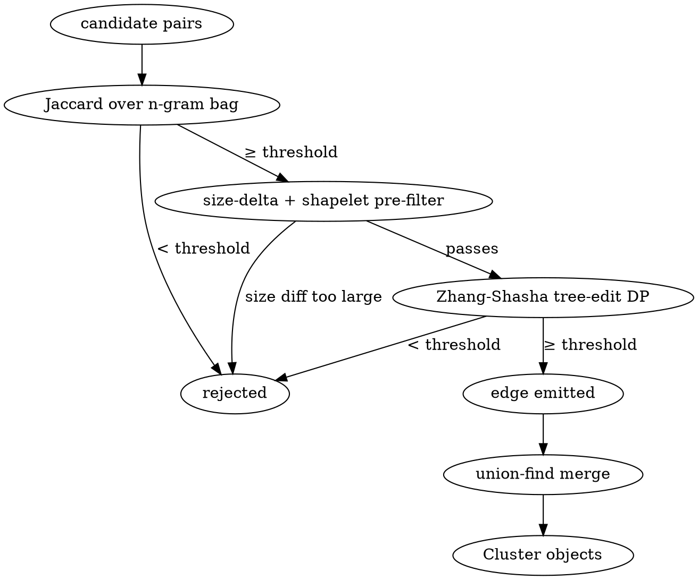

# Clustering algorithm

How phpdup turns N candidate-pair edges into M coherent clusters.

## Inputs

- `BlockIndex` — a flat dictionary of block id → Block.
- A list of edges `(a_id, b_id, similarity)` produced by the pair-
  score worker pool (or computed serially for small corpora).

## Output

A list of `Cluster` objects, each containing the participating
Blocks and the minimum pairwise similarity across the group.

## Algorithm

The pipeline (top to bottom):

1. **Hash buckets** for type-1 clones — blocks with identical
   `structuralHash` form a cluster trivially. No pair scoring
   needed.

2. **Jaccard over n-gram bag**. Cheap ngram-multiset Jaccard. The
   rare-gram inverted index (`NgramInvertedIndex`) keeps candidate
   generation near linear in the corpus size by skipping ngrams
   present in too many blocks (`max_df`).

3. **Tree-edit distance (APTED)**. For pairs that pass Jaccard,
   run a Zhang-Shasha DP with heavy-path key-root ordering and
   bounded early termination. Two cheap pre-filters trip first:
   size-delta and 64-bit shapelet-sketch overlap.

4. **Containment fallback**. For pairs that fail Jaccard but might
   be type-3 (one block is a near-subset of the other),
   `ContainmentSimilarity` reconsiders them when
   `optionalBlocksEnabled` is true.

5. **Union-find merge**. Edges that survive scoring feed a union-
   find structure; blocks in the same connected component become a
   `Cluster`.

## Two-tier TED pre-filters

Before invoking the full DP:

- `nodeCount(a) - nodeCount(b)` ≤ size budget. The size difference
  is a lower bound on the edit distance; when it alone exceeds the
  budget, no TED run can recover similarity.
- 64-bit (node-type, depth) shapelet sketch overlap. Computed in
  one tree walk per node; popcount of the AND vs OR gives an
  approximate Jaccard. Pairs with low overlap can't possibly be
  similar after editing.

Together these reject the bulk of false-positive Jaccard candidates
in O(1) per pair instead of O(n²) DP work.

## Parallelism

`PairScoreWorker` is fork-child-friendly; the parent shards the
candidate-pair list across workers and streams the scored edges
back via `WorkerPool::runStreaming()`. The same pattern is used by
`RefactorWorker` for the post-clustering anti-unification stage.

## Persistent cache

After successful clustering, `ClusterCache` snapshots the cluster
list to `<cacheDir>/clusters.idx`. Re-running on an unchanged
corpus skips Cluster + Refactor stages entirely (cache key is the
sorted `(block_id, file, structuralHash)` hash).
